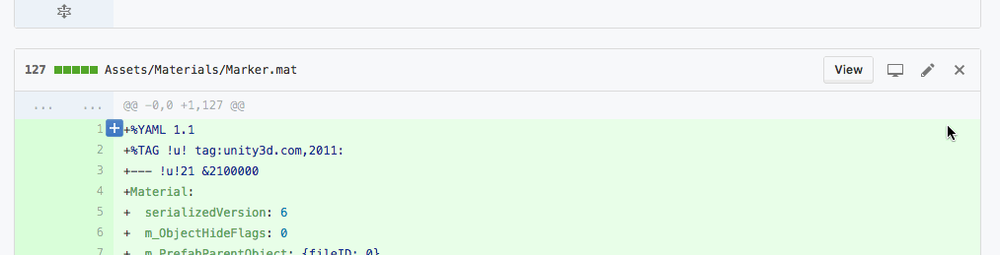

# Pipe it Down

[][extension]

A Chrome extension to reduce diff noise on GitHub.

## Installing for development

1. Open chrome://extensions/ in Chrome
1. Click "Developer mode" in the top right
1. Click "Load unpacked extension..." and select the extension's directory

## Development

1. Make changes
1. Open chrome://extensions/ in Chrome
1. Refresh the extensions page to have Chrome reload the plugin

[extension]: https://chrome.google.com/webstore/detail/pipe-it-down/faljmeoihicdhamcpfmafljlhfoljegm
